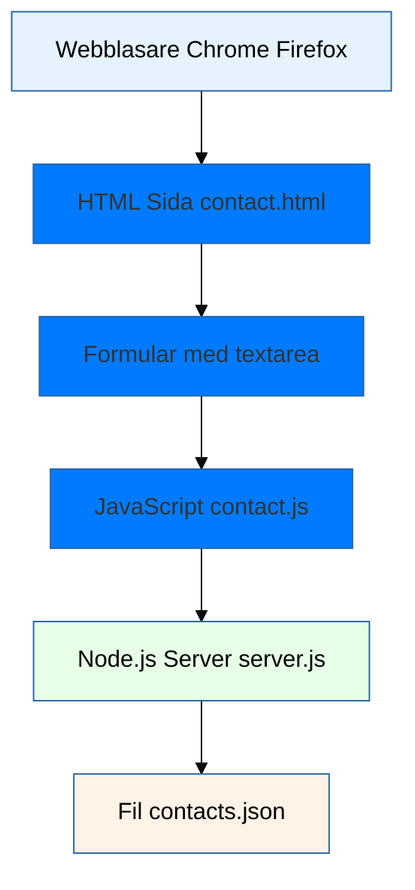
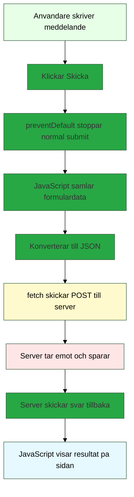
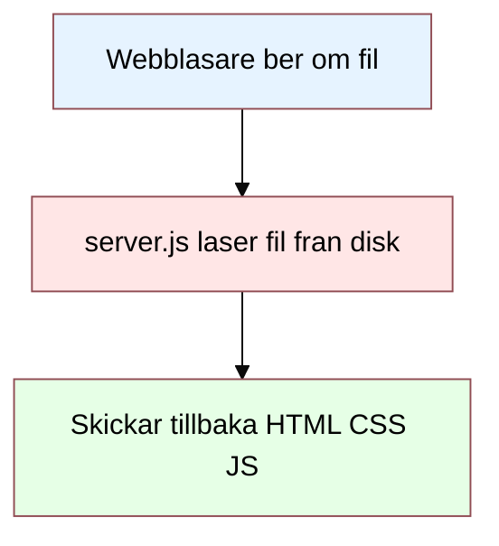
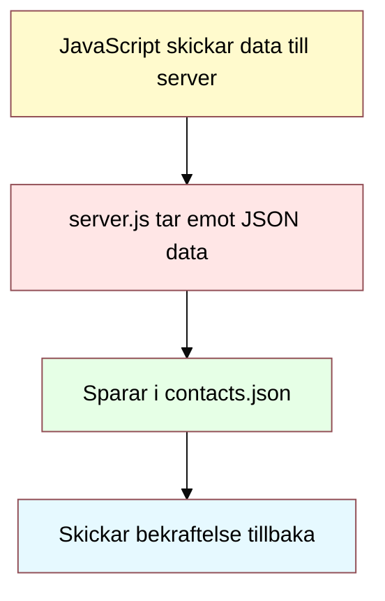
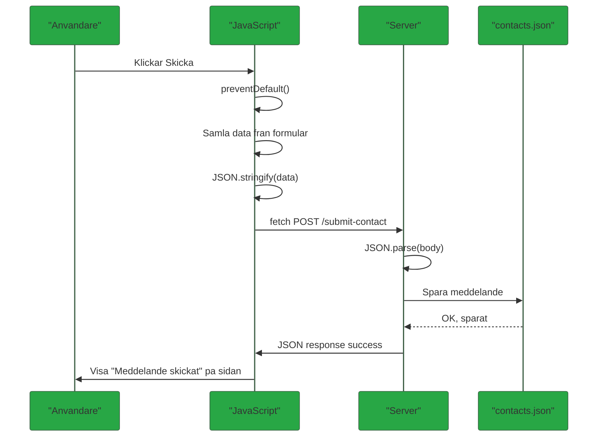
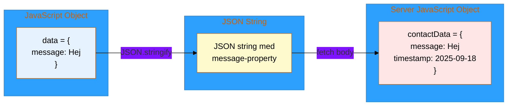
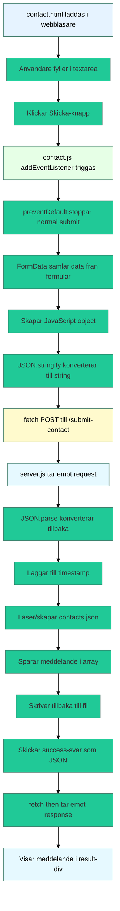

# Client-Server Kommunikation med Node.js

Detta dokument förklarar steg-för-steg hur client-server kommunikation fungerar med vårt contact-formulär exempel.

## 1. Övergripande systemet - Vad vi har byggt

**Förklaring:**

- **Webbläsaren** = Där användaren ser hemsidan
- **HTML** = Strukturen på sidan (formulär, knappar)
- **JavaScript** = Koden som gör sidan interaktiv
- **Node.js Server** = Programmet som tar emot data från formuläret
- **JSON-fil** = Där vi sparar meddelanden från användare

---

## 2. Vad händer när användaren skickar formuläret?

**Varför preventDefault?**

- Utan den: Formuläret skickar data på "gammalt vis" och sidan laddas om
- Med den: JavaScript kan ta kontroll och skicka data med fetch

---

## 3. Teknisk fördjupning - GET vs POST

### GET Requests - Hämta filer

### POST Requests - Skicka data

**GET = Hämta saker:**

- När vi skriver `localhost:3042/contact.html` i webbläsaren
- Servern hittar filen och skickar den till oss
- Som att "låna en bok från biblioteket"

**POST = Skicka saker:**

- När vi skickar formulärdata till servern
- Servern gör något med datan (sparar den)
- Som att "lämna in en blankett på biblioteket"

---

## 4. Fetch API - Modernt sätt att kommunicera

**Fetch = Modernt sätt att prata med servern:**

- Istället för att hela sidan laddas om
- Kan skicka data "i bakgrunden"
- Användaren märker knappt att något händer
- Som att skicka SMS istället för brev

---

## 5. JSON - Språket mellan client och server

**Varför JSON?**

- JavaScript Object = Bara JavaScript förstår
- JSON String = Alla programmeringsspråk förstår
- Som att översätta mellan språk så alla kan prata med varandra

**I vårt exempel:**

1. JavaScript skapar objekt: `{message: "Hej"}`
2. Konverterar till JSON: `'{"message":"Hej"}'`
3. Skickar som text till servern
4. Servern konverterar tillbaka till objekt
5. Lägger till timestamp och sparar

---

## 6. Hela kedjan - Från klick till svar

---

## Sammanfattning

### Grundbegrepp:

- **Client (Klient)** = Webbläsaren där användaren är
- **Server** = Node.js programmet som körs på datorn
- **HTTP** = Språket client och server pratar med varandra
- **GET** = "Ge mig en fil" (hämta hemsida)
- **POST** = "Ta emot denna data" (skicka formulär)
- **JSON** = Sätt att skicka data mellan client och server

### Flödet:

1. **Webbläsaren** laddar HTML-sidan
2. **Användaren** fyller i formuläret
3. **JavaScript** fångar submit och stoppar normal hantering
4. **Fetch** skickar data till servern i bakgrunden
5. **Servern** tar emot, bearbetar och sparar data
6. **Servern** skickar bekräftelse tillbaka
7. **JavaScript** visar resultatet för användaren

### Varför detta är bra:

- Sidan behöver inte laddas om
- Snabbare användarupplevelse
- Kan hantera fel på ett bra sätt
- Modernt sätt att bygga webbappar
