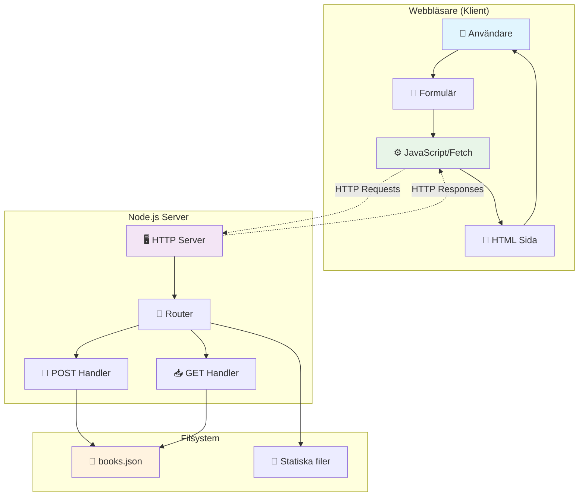

# Övergripande Systemarkitektur - Bokbibliotek App

Detta diagram visar den grundläggande arkitekturen för hela bokbibliotek-applikationen.

## Förklaring av komponenter:

### Klient-sidan (Webbläsare):

- **Användare**: Interagerar med formuläret
- **HTML**: Strukturen för sidan och formuläret
- **Formulär**: Input-fält för bokdata
- **JavaScript**: Hanterar fetch-anrop och DOM-manipulation

### Server-sidan (Node.js):

- **HTTP Server**: Lyssnar på port 3043
- **Router**: Dirigerar requests till rätt handler
- **POST Handler**: Behandlar nya böcker
- **GET Handler**: Serverar filer och hämtar bokdata

### Data/Filer:

- **books.json**: Persistent lagring av bokdata
- **Statiska filer**: HTML, CSS, JS-filer

## Diskussionspunkter:

1. **Separation of Concerns**: Klient vs Server ansvarsområden
2. **HTTP som kommunikationsprotokoll**
3. **Stateless kommunikation**: Varje request är oberoende
4. **Filbaserad databas**: Enkel persistent lagring
