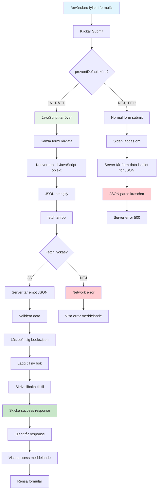

# Formulär Submit Flöde - Från användare till server

Detta diagram visar det detaljerade flödet när en användare skickar in formuläret för att lägga till en ny bok.

## Kritiska punkter att diskutera:

### 1. preventDefault() - Varför behövs den?

- **Utan**: Normal HTML form submit → sidan laddas om
- **Med**: JavaScript kan ta kontroll över processen

### 2. Data transformation:

- **HTML formulär** → JavaScript objekt → **JSON string** → Server

### 3. Felhantering på flera nivåer:

- **JavaScript fel**: Formulärvalidering, JSON konvertering
- **Network fel**: Fetch misslyckas
- **Server fel**: JSON parsing, filhantering

### 4. User Experience:

- **Feedback**: Success/error meddelanden
- **State management**: Rensa formulär efter success

## Vanliga fel vi kan stöta på:

1. **Glömmer preventDefault()** → Sidan laddas om
2. **Skickar FormData istället för JSON** → Server kan inte hantera
3. **Fel Content-Type header** → Server förstår inte datatypen
4. **Ingen felhantering** → Tyst misslyckande
