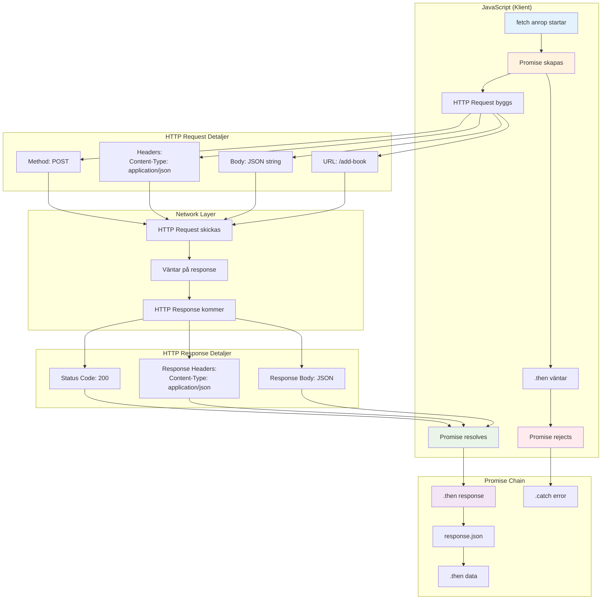
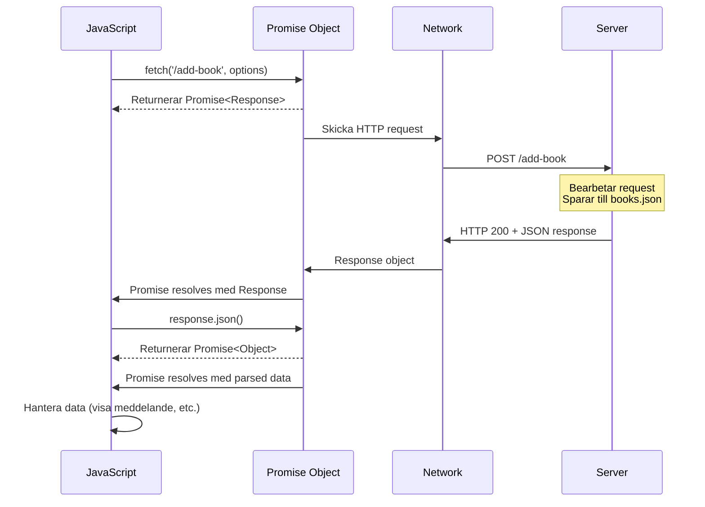

# Fetch API och HTTP Kommunikation - Tekniska detaljer

Detta diagram fokuserar på den tekniska delen av fetch API:t och HTTP-kommunikationen.



## Promise-kedjan i detalj:



## Viktiga diskussionspunkter:

### 1. Promises vs Callbacks:

- **Promise**: Modernare, kedja-bar, lättare att läsa
- **Callback**: Äldre mönster, "callback hell"

### 2. Async/Await alternativ:

```javascript
// Med .then() kedja
fetch("/add-book", options)
  .then((response) => response.json())
  .then((data) => console.log(data))
  .catch((error) => console.error(error));

// Med async/await
try {
  const response = await fetch("/add-book", options);
  const data = await response.json();
  console.log(data);
} catch (error) {
  console.error(error);
}
```

### 3. HTTP Headers betydelse:

- **Content-Type**: Talar om dataformat
- **Accept**: Vad klienten förväntar sig tillbaka
- **Authorization**: För säkerhet (inte i denna övning)

### 4. Status codes:

- **200**: OK - Success
- **400**: Bad Request - Fel i data
- **404**: Not Found - Endpoint finns inte
- **500**: Server Error - Server kraschar

### 5. Error handling:

- **Network errors**: fetch() rejects
- **HTTP errors**: fetch() resolves men status ≥ 400
- **JSON parsing errors**: response.json() kan faila
