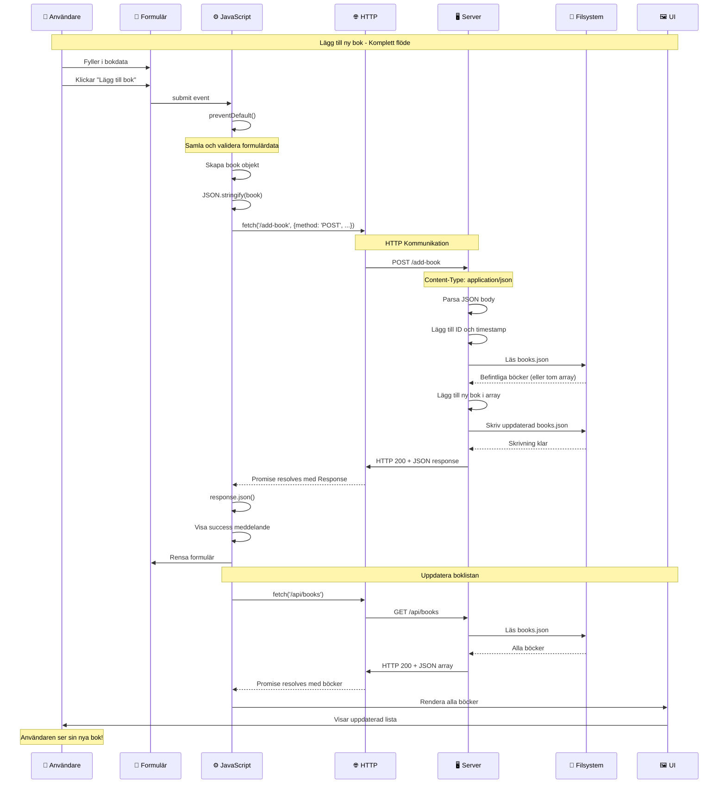
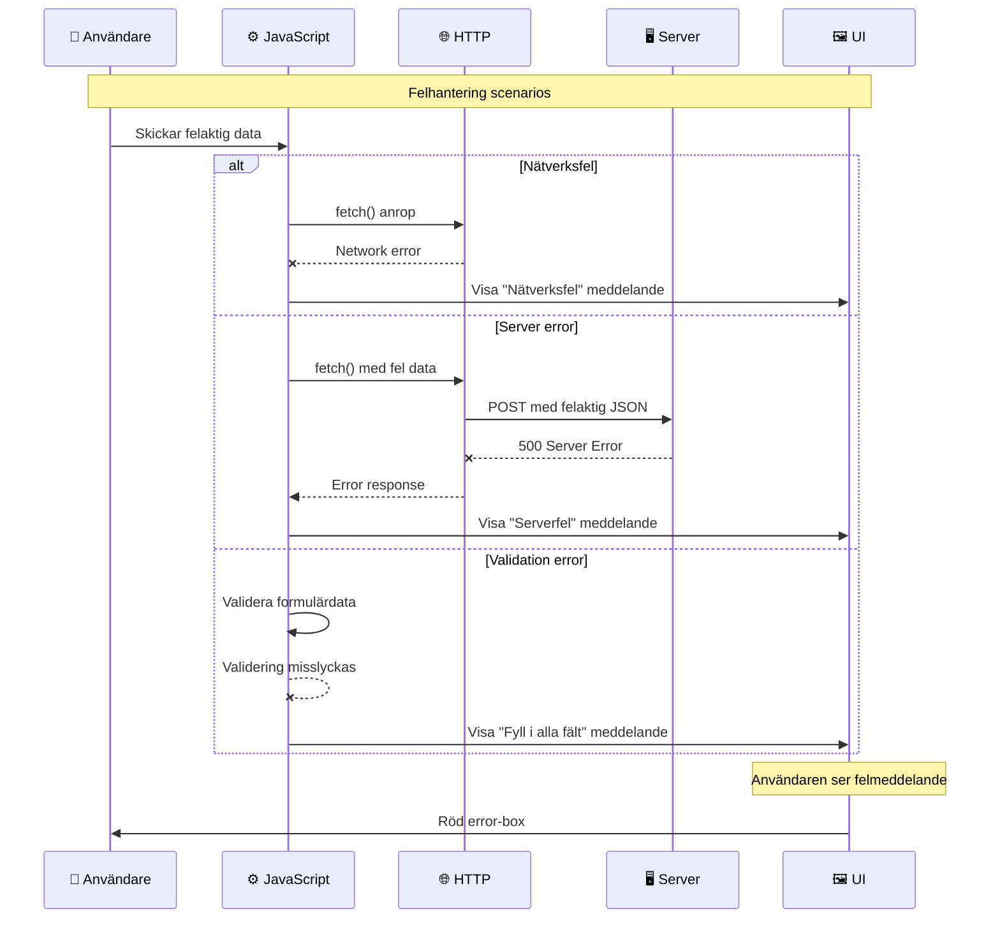

# Sekvensdiagram - Komplett tidslinje för bokregistrering

Detta diagram visar den kronologiska ordningen av alla händelser från det att användaren klickar submit till att boken visas i listan.

## Alternativt flöde - När fel uppstår:

## Tidsaspekter att diskutera:

### 1. **Synkron vs Asynkron kod:**

- **Synkron**: Blockerar tråden, väntar på resultat
- **Asynkron**: Fortsätter medan operation pågår

### 2. **Event Loop:**

- JavaScript är single-threaded
- Asynkrona operationer hanteras av Web APIs
- Callbacks placeras i event queue

### 3. **Promise states:**

- **Pending**: Operation pågår
- **Fulfilled**: Operation lyckades
- **Rejected**: Operation misslyckades

### 4. **Race conditions:**

- Vad händer om användaren klickar submit flera gånger snabbt?
- Bör man disabla knappen under request?

## Diskussionsfrågor:

1. **Varför är fetch() asynkront?** (I/O operationer tar tid)
2. **Vad händer om servern är långsam?** (Loading states)
3. **Hur hantera flera samtidiga requests?** (Request queueing)
4. **Varför validera på både klient och server?** (Säkerhet vs UX)
