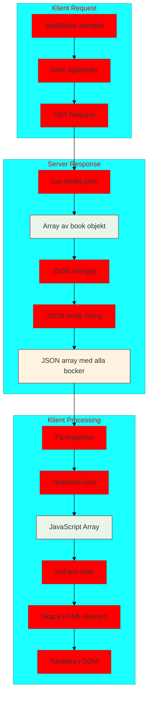

# Data Transformation Flöde - Från form till JSON och tillbaka

Detta diagram fokuserar på hur data transformeras genom hela systemet och de olika format som används.

```mermaid
%%{init: {'theme':'base', 'themeVariables': {'primaryColor':'#ff0000'}}}%%
graph TD
    subgraph "Klient Input"
        A1[HTML Form Values]
        A2[titel: Dracula<br/>forfatter: Bram Stoker<br/>genre: deckare]
        A3[FormData objekt]
    end

    subgraph "JavaScript Transformation"
        B1[Samla form data]
        B2[JavaScript Object]
        B3[Object med titel forfatter genre]
        B4[JSON.stringify]
        B5[JSON String]
        B6[JSON string med bokdata]
    end

    subgraph "HTTP Transport"
        C1[HTTP Request Body]
        C2[Content-Type: application/json]
        C3[Network transmission]
    end

    subgraph "Server Processing"
        D1[Raw request body]
        D2[JSON.parse]
        D3[JavaScript Object]
        D4[Lagg till metadata]
        D5[Object med titel forfatter genre id datum]
    end

    subgraph "File Storage"
        E1[books.json lasning]
        E2[Array av bocker]
        E3[Lagg till ny bok]
        E4[Skriv tillbaka till fil]
        E5[Array med alla bocker]
    end

    subgraph "Response Journey"
        F1[Success Response]
        F2[JSON Response]
        F3[Success JSON response]
        F4[HTTP Response]
        F5[Klient tar emot]
        F6[response.json]
        F7[JavaScript Object]
        F8[Visa meddelande]
    end

    A1 --> A2
    A2 --> A3
    A3 --> B1
    B1 --> B2
    B2 --> B3
    B3 --> B4
    B4 --> B5
    B5 --> B6

    B6 --> C1
    C1 --> C2
    C2 --> C3

    C3 --> D1
    D1 --> D2
    D2 --> D3
    D3 --> D4
    D4 --> D5

    D5 --> E1
    E1 --> E2
    E2 --> E3
    E3 --> E4
    E4 --> E5

    E5 --> F1
    F1 --> F2
    F2 --> F3
    F3 --> F4
    F4 --> F5
    F5 --> F6
    F6 --> F7
    F7 --> F8

    style B3 fill:#e8f5e8
    style B6 fill:#fff3e0
    style D3 fill:#e8f5e8
    style E5 fill:#f3e5f5
    style F7 fill:#e8f5e8
```



## GET Request - Hämta böcker flöde:



## Viktiga transformationspunkter:

### 1. **Form Data → JavaScript Object:**

```javascript
// Manuell insamling
const book = {
  titel: document.getElementById("title").value,
  författare: document.getElementById("author").value,
  genre: document.getElementById("genre").value,
};

// Alternativ med FormData
const formData = new FormData(form);
const book = Object.fromEntries(formData);
```

### 2. **JavaScript Object → JSON String:**

```javascript
const jsonString = JSON.stringify(book);
// Resultat: '{"titel":"Dracula","författare":"Bram Stoker",...}'
```

### 3. **JSON String → JavaScript Object:**

```javascript
const bookObject = JSON.parse(jsonString);
// Resultat: {titel: "Dracula", författare: "Bram Stoker", ...}
```

### 4. **Array manipulation för fillagring:**

```javascript
// Läs befintliga böcker
let books = JSON.parse(fs.readFileSync("books.json", "utf8"));
// Lägg till ny bok
books.push(newBook);
// Spara tillbaka
fs.writeFileSync("books.json", JSON.stringify(books, null, 2));
```

## Diskussionspunkter:

### 1. **Varför JSON?**

- **Standardiserat**: Alla språk kan hantera JSON
- **Läsbart**: Människor kan läsa det
- **Kompakt**: Mindre än XML
- **JavaScript native**: Inbyggt stöd

### 2. **Form-data vs JSON:**

- **Form-data**: Naturligt för HTML formulär
- **JSON**: Bättre för API:er och strukturerad data

### 3. **Serialisering/Deserialisering:**

- **Serialisering**: Objekt → String (för transport/lagring)
- **Deserialisering**: String → Objekt (för användning)

### 4. **Data validering:**

- **Klient-sida**: UX, snabb feedback
- **Server-sida**: Säkerhet, slutgiltig validering

### 5. **Vanliga fel:**

- **Circular references**: JSON.stringify() kraschar
- **undefined values**: Försvinner i JSON
- **Date objects**: Blir strings i JSON
- **Functions**: Försvinner i JSON
